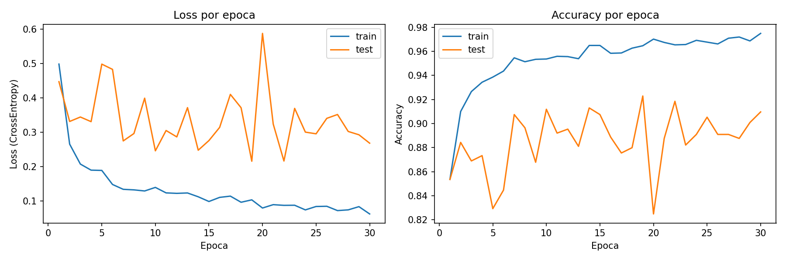
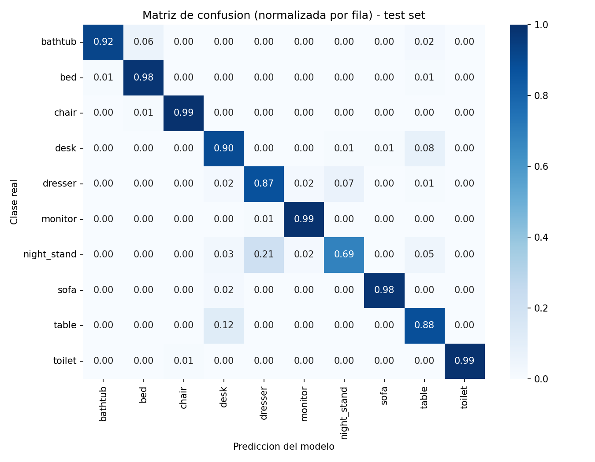
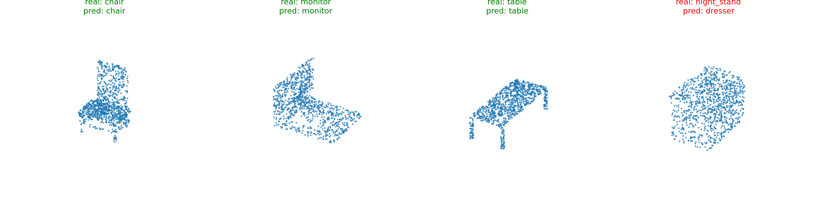

# PointNet simplificado para clasificación de formas 3D (ModelNet10)

**Resultado final: 92.3% de accuracy en el test set de ModelNet10** con una
arquitectura PointNet deliberadamente simplificada (sin T-Net) entrenada en
~9h de trabajo total. Detalles y análisis de errores más abajo.

## Qué es esto

Proyecto de portfolio: un clasificador de nubes de puntos 3D entrenado sobre
[ModelNet10](https://modelnet.cs.princeton.edu/), usando una versión
**simplificada** de la arquitectura PointNet (Qi et al., 2017,
["PointNet: Deep Learning on Point Sets for 3D Classification and
Segmentation"](https://arxiv.org/abs/1612.00593)).

El objetivo no es igualar el estado del arte, sino demostrar que entiendo
**por qué** PointNet está diseñado como está diseñado (invarianza a
permutación de puntos vía max-pooling, MLPs compartidos por punto) y ser
explícito sobre qué he simplificado respecto al paper original y por qué.

## Por qué este proyecto (contexto)

Lo preparé como proyecto de portfolio para una entrevista como Application
Engineer en una empresa de deep learning 3D aplicado a datos CAD/CAE. Con
9 horas de trabajo repartidas en 3 días, prioricé:

- Entender y poder explicar cada componente del modelo, no maximizar accuracy.
- Ser honesto sobre las simplificaciones (ver más abajo) en vez de esconderlas.
- Dejar un camino claro de "qué haría con más tiempo".

## Simplificaciones conscientes respecto al paper original

| Aspecto | Paper original (PointNet 2017) | Este proyecto | Por qué |
|---|---|---|---|
| Alineación espacial | Usa una T-Net (mini red que predice una matriz de transformación 3x3 aplicada a los puntos de entrada, y otra 64x64 para features) | **Omitida** | La T-Net añade complejidad e inestabilidad de entrenamiento para ganar robustez a rotaciones arbitrarias. En ModelNet10 los modelos ya vienen mayormente alineados por eje, así que el beneficio es menor que el coste de explicar/depurar una red dentro de la red. Lo documento como omisión consciente, no como desconocimiento. |
| Dataset | ModelNet40 (40 clases) en el paper original | ModelNet10 (10 clases) | Subconjunto más pequeño y más limpio, pensado para entrenar en horas (no días) en una T4 gratuita de Colab. |
| Nº de épocas / búsqueda de hiperparámetros | Entrenamiento extenso con scheduler, batch norm cuidadosamente ajustado, etc. | 30 épocas fijas, Adam sin scheduler de learning rate, sin búsqueda de hiperparámetros | Presupuesto de tiempo de 9h total, no una GPU dedicada. Se nota en las curvas de entrenamiento (ver Resultados): el test loss oscila bastante entre épocas, algo que un scheduler probablemente suavizaría. |
| Validación durante el entrenamiento | Split train/val/test separado; el test solo se mira una vez al final | Se mide accuracy sobre el test set en cada época (para graficar la curva y guardar el mejor checkpoint) | ModelNet10 no trae un split de validación propio, y no hay una fase de tuneo de hiperparámetros que justifique mantener el test "ciego". El número final de accuracy es por tanto ligeramente optimista respecto a un test set nunca visto durante el entrenamiento — ver `src/train.py`. |
| Muestreo de puntos | El paper asume nubes de puntos ya muestreadas de forma consistente | Muestreo uniforme por área de superficie sobre la malla `.off` original (`trimesh.sample.sample_surface`) | Es una decisión de preprocesado propia, no del paper — ver `src/data.py`. |

## Estructura del repo

```
.
├── README.md
├── requirements.txt
├── src/
│   ├── data.py        # descarga, preprocesado y Dataset/DataLoader de PyTorch
│   ├── model.py        # arquitectura PointNet simplificada
│   ├── train.py         # loop de entrenamiento
│   └── evaluate.py    # accuracy, matriz de confusión, visualización de predicciones
├── notebooks/
│   └── pointnet_modelnet10.ipynb   # notebook único: datos + entrenamiento + evaluación (Colab)
├── data/               # dataset descargado (no versionado, ver .gitignore)
└── outputs/            # checkpoints y figuras generadas (no versionado)
```

## Cómo ejecutarlo (Google Colab)

1. Abre [colab.research.google.com](https://colab.research.google.com).
2. `File > Open notebook > GitHub`, pega la URL de este repo
   (`https://github.com/marsaliborra/3d_classifier`) y selecciona
   `notebooks/pointnet_modelnet10.ipynb`.
3. `Runtime > Change runtime type > T4 GPU`.
4. Ejecuta las celdas en orden. La primera celda clona este repo dentro del
   propio Colab (`!git clone ...`) para poder importar `src/`.

Es un único notebook de principio a fin (datos + entrenamiento + evaluación)
a propósito: Colab gratuito solo permite una sesión con GPU activa a la vez,
así que tener dos notebooks separados obligaba a cerrar la sesión del
primero para abrir el segundo, perdiendo la caché de datos ya descargada.

## Resultados

Entrenado 30 épocas, batch size 32, Adam (lr=1e-3), 1024 puntos por nube.
**Mejor accuracy en test: 92.3%** (época 19 de 30; checkpoint guardado como
`best_model.pt`).

### Curvas de entrenamiento



El train accuracy sube de forma limpia hasta ~97%, pero el test accuracy
oscila bastante (82%-92%) de una época a otra en vez de converger suave, con
algún pico de loss puntual (p.ej. época 20). No leo esto como overfitting
galopante — el train y el test no se separan progresivamente, más bien el
test es ruidoso — sino como una consecuencia esperable de: (a) no usar
scheduler de learning rate, y (b) medir sobre un test set de solo 908
muestras, donde cada batch mal clasificado pesa proporcionalmente más que en
un validation set más grande.

### Matriz de confusión



La diagonal es fuerte para la mayoría de clases (`chair`, `monitor`,
`toilet`, `bed`, `sofa` ≥ 0.98), pero hay dos confusiones claras y con
sentido geométrico:

- **`night_stand` → `dresser` (21%)**: sin textura ni escala real de
  referencia, una mesita de noche y una cómoda son ambas, en esencia, "cajas
  rectangulares con cajones" — formas muy parecidas como nube de puntos pura.
- **`table` ↔ `desk` (12% / 8%)**: ambas son "superficie plana + patas"; la
  diferencia (un desk suele tener alguna estructura adicional, cajones
  laterales, etc.) es sutil a nivel de forma global.

Esto es exactamente el tipo de error que cabría esperar de un modelo que
**no tiene T-Net ni ninguna otra señal más allá de la geometría en bruto**:
confunde formas que son genuinamente ambiguas por geometría, no clases sin
relación entre sí.

### Ejemplos de predicciones



3 de 4 correctas; el único fallo (`night_stand` predicho como `dresser`) es
consistente con la matriz de confusión de arriba.

## Qué haría distinto con más tiempo

- **Reintroducir la T-Net** del paper original y comparar accuracy con/sin
  ella — la omití conscientemente por presupuesto de tiempo (ver tabla de
  simplificaciones), pero con más margen sería el primer experimento a
  correr, ya que es la pieza que más claramente falta respecto al paper.
- **Scheduler de learning rate** (p.ej. `StepLR` o `CosineAnnealingLR`):
  las curvas de test loss/accuracy oscilan bastante entre épocas: es
  razonable pensar que un learning rate decreciente suavizaría esas
  oscilaciones en las épocas finales.
- **Split de validación separado del test**, para poder hacer *early
  stopping* o comparar configuraciones sin sesgar la métrica final que se
  reporta (ver limitación documentada en la tabla de simplificaciones).
- **Data augmentation** (rotación aleatoria sobre el eje vertical, jitter de
  puntos): el paper original la usa y es especialmente relevante para
  ayudar precisamente con las confusiones `night_stand`/`dresser` y
  `table`/`desk`, que dependen de la orientación relativa de detalles finos.
- **Búsqueda de hiperparámetros con Optuna** (batch size, lr, dropout) en
  vez de la configuración fija actual — herramienta que ya usé en mi tesis
  de máster, aquí no la apliqué solo por presupuesto de tiempo, no por
  desconocimiento.

## Next steps

Una extensión natural de este proyecto, dado que la empresa a la que aplico
trabaja en 3D deep learning aplicado a datos CAD/CAE con **NVIDIA
Omniverse**: exportar las nubes de puntos de test junto con su etiqueta
predicha a formato **USD** (Universal Scene Description), coloreando cada
punto según acierto/error del modelo, para poder inspeccionar los
resultados directamente en Omniverse en vez de en scatter plots de
matplotlib. No lo he implementado en el alcance de estas 9h, pero es el
puente más directo entre este proyecto de portfolio y el tipo de pipeline
de visualización 3D con el que trabajaría en el puesto.

## Plan de trabajo (3 días, 9h)

- **Día 1 (3h):** setup del repo, carga/exploración de datos, preprocesado
  y Dataset de PyTorch.
- **Día 2 (3h):** arquitectura del modelo simplificado, loop de
  entrenamiento, primer entrenamiento en Colab.
- **Día 3 (3h):** evaluación (accuracy, matriz de confusión, visualización
  de predicciones), redacción final del README con resultados reales.
